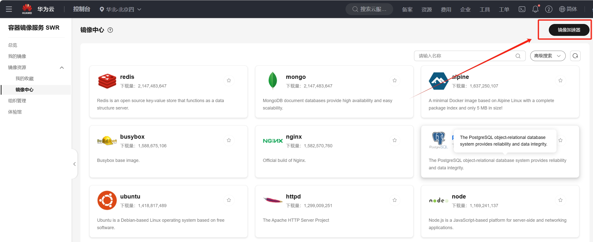

# 在windows系统下部署Ollama和OpenWebUI
日期：2024年11月20日

主要参考了[wsl安装](https://blog.csdn.net/wangtcCSDN/article/details/137950545)和[docker安装](https://blog.csdn.net/qq_43840665/article/details/140684568)两篇博客

## 1、安装WSL
<p>第一步，打开开始菜单，在开始菜单中输入启用或关闭 Windows 功能，在弹出的窗口中勾选<b>虚拟机平台</b>和<b>适用于 Linux 的 Windows 子系统</b>，确定之后<b>重启系统</b>。</p>
<p>第二步，重启电脑后，打开<b>Windows PowerShell</b>用管理员身份运行，执行以下命令，即可成功装入WSL</p>

```bash
wsl.exe –update
```

## 2、安装Ubuntu24.04
### 2.1 安装Ubuntu
<p>第一步，打开<b>Microsoft Store</b>，搜索Ubuntu并下载，下载完成后，会让你创建用户和密码，然后即可安装成功。</p>
<p>另外，如果想查询当前安装的 Ubuntu 版本使用下面命令</p>

```bash
lsb_release -a
```  
### 2.2 更新清华源
第二步，前往[清华镜像站](https://mirrors.tuna.tsinghua.edu.cn/help/ubuntu/)即可配置对应的镜像源，这里有两种情况

<p>情况1：如果是<b>ubuntu24.04之前的版本</b>，那么应该用:</p>

```bash
sudo nano /etc/apt/sources.list
```

情况2：如果是<b>ubuntu24.04</b>的版本那么要用
```bash
sudo nano /etc/apt/sources.list.d/ubuntu.sources
```
第三步，下面是<b>ubuntu24.04</b>的对应软件源：
```
Types: deb
URIs: https://mirrors.tuna.tsinghua.edu.cn/ubuntu
Suites: noble noble-updates noble-backports
Components: main restricted universe multiverse
Signed-By: /usr/share/keyrings/ubuntu-archive-keyring.gpg

Types: deb
URIs: https://mirrors.tuna.tsinghua.edu.cn/ubuntu
Suites: noble-security
Components: main restricted universe multiverse
Signed-By: /usr/share/keyrings/ubuntu-archive-keyring.gpg
```
第四步，按下<b>Ctrl + O</b>并<b>Enter</b>保存，再按下<b>Ctrl + X</b>退出 nano，保存之后，输入以下内容更新镜像源
```bash
sudo apt update && sudo apt upgrade -y
```

## 3、docker安装
第一步，安装依赖包
```bash
sudo apt install apt-transport-https ca-certificates curl gnupg lsb-release
```

第二步，添加阿里云镜像源和密钥
```bash
curl -fsSL https://mirrors.aliyun.com/docker-ce/linux/ubuntu/gpg | sudo gpg --dearmor -o /usr/share/keyrings/docker-archive-keyring.gpg
```
第三步，添加阿里云镜像源
```bash
echo "deb [arch=amd64 signed-by=/usr/share/keyrings/docker-archive-keyring.gpg] https://mirrors.aliyun.com/docker-ce/linux/ubuntu $(lsb_release -cs) stable" | sudo tee /etc/apt/sources.list.d/docker.list > /dev/null
```
第四步，从软件源中更新安装工具包
```bash
sudo apt update
```
第五步，安装Docker套件
```bash
sudo apt install docker-ce docker-ce-cli containerd.io
```
第六步，配置Docker镜像源，前往[华为云镜像](https://console.huaweicloud.com/swr/?region=cn-north-4#/swr/mirror)，在华为云镜像的个人镜像中，点击**镜像加速器**，复制里面的镜像地址

```bash
1.创建Docker文件夹
sudo mkdir -p /etc/docker
2.写入个人镜像源
sudo tee /etc/docker/daemon.json <<-'EOF'
{
  "registry-mirrors": ["https://要写入的镜像源.cn"]
}
EOF
3.重启守护进程和docker引擎
sudo systemctl daemon-reload
sudo systemctl restart docker
```
第七步，测试镜像源配置成功
```bash
sudo docker pull hello-world
```

## 4、docker desktop安装
第一步，在[docker官网](https://www.docker.com/products/docker-desktop/)里下载<b>docker desktop</b>的windows版本即可

第二步，安装好**Docker Desktop**之后，打开**Docker Desktop**，检查**container**栏，现在应该是空的，不要关闭**Docker Desktop**，后续部署都要保证**Docker Desktop**是打开状态

## 5、下载 Ollama 和 OpenWebUI 
### 5.1 进入WSL
第一步，用<b>管理员身份</b>进入<b>Windows PowerShell</b>然后输入进入Ubuntu系统，后续部署都是利用**wsl**中的**docker**来进行
```bash
wsl
```
### 5.2 拉取Ollama的docker镜像
<p>第二步，用docker<b>拉取镜像</b>，并创建名字叫<b>ollama</b>的容器。Ollama有CPU版本和GPU版本，<b>CPU版本</b>和<b>GPU版本</b>两个选择一个即可，建议用GPU版本，否则推理速度非常慢</p>
<p>情况1：CPU版本，直接输入</p>

```bash
sudo docker run -d -v ollama:/root/.ollama -p 11434:11434 --name ollama ollama/ollama
```
情况2：GPU版本，先装[英伟达工具](https://docs.nvidia.com/datacenter/cloud-native/container-toolkit/latest/install-guide.html#installation)，然后再输入
```bash
Sudo docker run -d --gpus=all -v ollama:/root/.ollama -p 11434:11434 --name ollama ollama/ollama
```
### 5.3 运行 Ollama 库的模型
第三步，Ollama容器建立后，直接运行容器，如下命令即可
```bash
docker exec -it ollama ollama run llama2
```
同理，运行<b>Qwen2.5</b>和<b>gemma</b>的命令为
```bash
docker exec -it ollama ollama run qwen2.5:7b
```
```bash
docker exec -it ollama ollama run gemma:7b
```
同时，还可以参考[Ollama库的其余模型](https://ollama.com/library)，直接调用即可
### 5.4 安装 OpenWebUI
第四步，用<b> docker </b>安装<b>OpenWebUI</b>，继续在<b> PowerShell </b>中输入
```bash
docker run -d -p 3000:8080 --add-host=host.docker.internal:host-gateway -v open-webui:/app/backend/data --name open-webui --restart always ghcr.io/open-webui/open-webui:main
```
即可，然后在<b>本地浏览器输入</b>[http://localhost:3000](http://localhost:3000) 中即可看到UI界面，自行创建<b>邮箱和密码</b>即可进入。进入后，即可看到Ollama容器中正在运行的模型。

### 5.5 打开Docker Desktop
<p>当<b>步骤 5.3</b>和<b>步骤 5.4</b>都在<b> Power Shell </b>中运行时，那么，<b> Docker Desktop </b>中的<b> container </b>栏中会出现两个新的容器</p>


<p>当下次想重新执行时，直接在<b> Docker Desktop </b>中点击打开这两个容器即可</p>

## 6、注意事项
第一，如果先装docker然后部署镜像，再装Docker Desktop，会出现<b>原先拉取的docker的镜像集体消失的情况。</b> 正确顺序是：先装WSL，确定版本为WSL2，然后装Docker Desktop，然后再在WSL2中装<b> docker </b>

第二，要注意docker在封装ollama容器时，很可能会遗失启动指令，所以<b>最好不要直接用别人封装后的ollama容器</b>